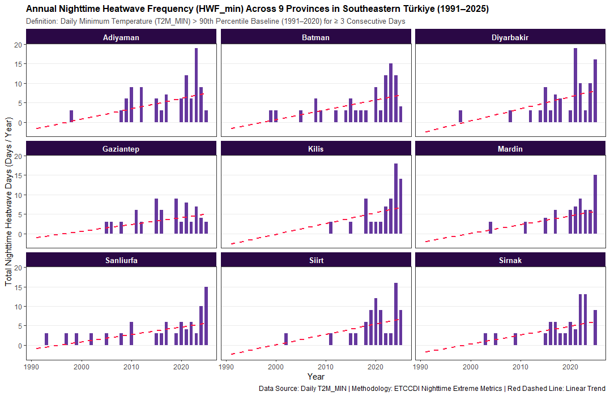
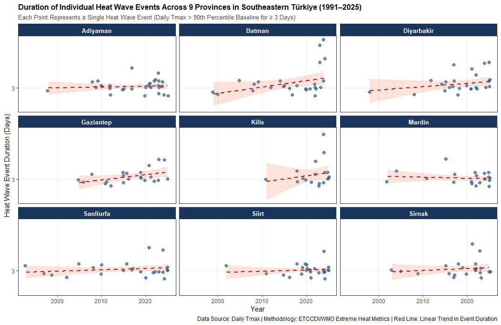
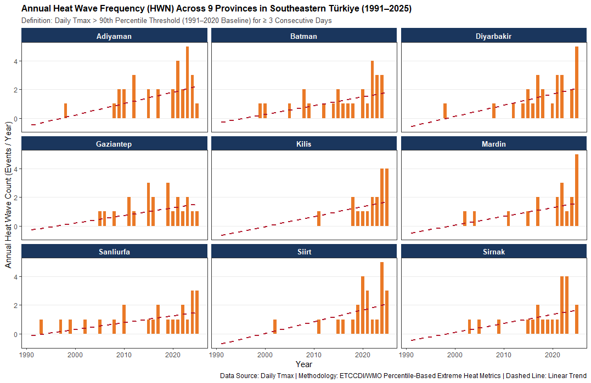
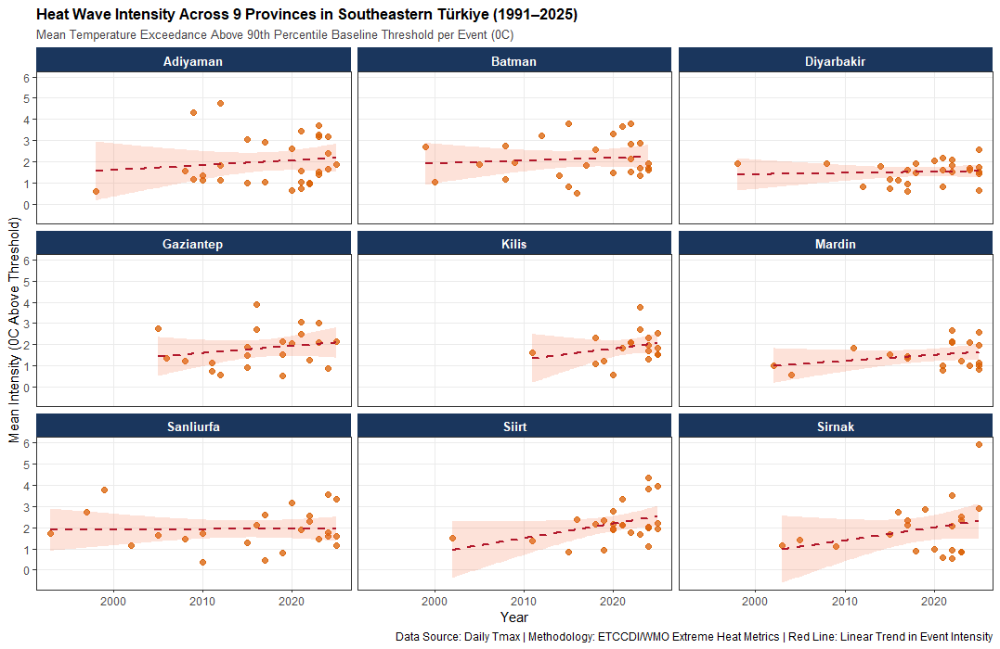

# Temporal Changes in Heatwaves in Southeastern Türkiye

## Overview

This repository presents a climatological analysis of the temporal variability and long-term changes in heatwaves across Southeastern Türkiye using daily meteorological data from the NASA Prediction of Worldwide Energy Resources (NASA POWER) project.

The study focuses on the frequency, duration, intensity, and cumulative thermal characteristics of heatwave events across nine provinces of Southeastern Türkiye.

---

# Key Results

## Heatwave Frequency and Temporal Evolution


This figure illustrates the temporal evolution of heatwave occurrence during the study period.

## Regional Heatwave Frequency


The regional comparison highlights differences in heatwave frequency among the provinces of Southeastern Türkiye.

## Heatwave Duration



The temporal pattern of heatwave duration provides information on the persistence of extreme-heat events.

## Heatwave Characteristics



This figure summarizes the changing characteristics of heatwave events and their temporal variability.

## Extreme Heat Analysis



The analysis provides an additional assessment of extreme-temperature behavior across the study region.

## Southeastern Türkiye Heatwave Assessment



The figure provides a regional overview of the observed heatwave characteristics across Southeastern Türkiye.

---

# Main Findings

The results indicate an increasing tendency in the occurrence and persistence of heatwave events during the analyzed period.

The figures also reveal substantial spatial variability among the nine provinces. Heatwave frequency, duration, and intensity do not evolve uniformly across Southeastern Türkiye.

Overall, the findings demonstrate the importance of evaluating multiple heatwave characteristics simultaneously rather than relying solely on changes in mean temperature.

> **Note:** The current figures represent the analytical workflow and preliminary outputs. Final climatological conclusions will be based on the complete NASA POWER observational dataset and statistical significance testing.

---

## Research Question

> **Are heatwaves becoming more frequent, longer-lasting, and more intense across Southeastern Türkiye?**

The study investigates whether the characteristics of heatwave events have changed significantly over time and whether these changes exhibit spatial and temporal differences across the region.

---

## Study Region

The analysis covers:

- Adıyaman
- Batman
- Diyarbakır
- Gaziantep
- Kilis
- Mardin
- Siirt
- Şanlıurfa
- Şırnak

---

## Data Source

### NASA POWER

Daily meteorological data are obtained from the NASA Prediction of Worldwide Energy Resources (NASA POWER).

Primary variables include:

| Variable | Description | Unit |
|---|---|---|
| `T2M` | Air temperature at 2 m | °C |
| `T2M_MAX` | Maximum air temperature at 2 m | °C |
| `T2M_MIN` | Minimum air temperature at 2 m | °C |
| `RH2M` | Relative humidity at 2 m | % |

### Temporal Coverage

**1981–2025**

---

## Heatwave Definition

A percentile-based threshold approach is used to identify extreme heat.

The primary framework uses the **90th percentile (P90)** of daily maximum temperature.

Heatwave events are identified when temperatures exceed the location-specific threshold for a predefined number of consecutive days.

This approach accounts for regional climatic differences and provides a consistent framework for comparing heatwave characteristics across Southeastern Türkiye.

---

## Heatwave Indicators

The analysis evaluates:

- Heatwave frequency
- Heatwave duration
- Total heatwave days
- Heatwave intensity
- Cumulative heatwave magnitude
- Hot days
- Hot nights

---

## Statistical Analysis

The temporal characteristics of heatwaves are evaluated using:

### Mann–Kendall Test

Used to identify statistically significant monotonic trends.

### Sen's Slope

Used to estimate the magnitude and direction of temporal trends.

### Pettitt Test

Used to identify potential abrupt change points within the heatwave time series.

---

## Analytical Workflow

```text
NASA POWER Daily Data
        ↓
Data Acquisition
        ↓
Data Cleaning
        ↓
Daily Temperature Series
        ↓
P90 Threshold Calculation
        ↓
Heatwave Detection
        ↓
Frequency / Duration / Intensity
        ↓
Annual Aggregation
        ↓
Mann–Kendall Test
        ↓
Sen's Slope
        ↓
Pettitt Change-Point Test
        ↓
Visualization
        ↓
Climate Interpretation
