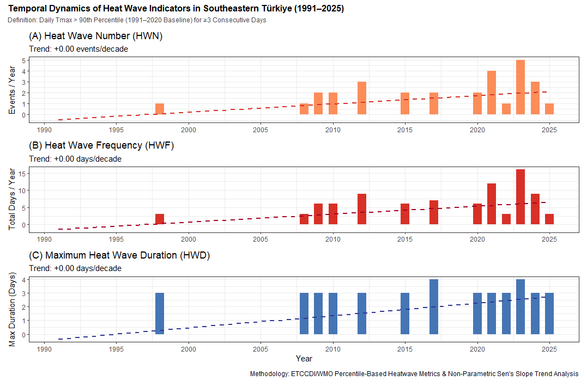
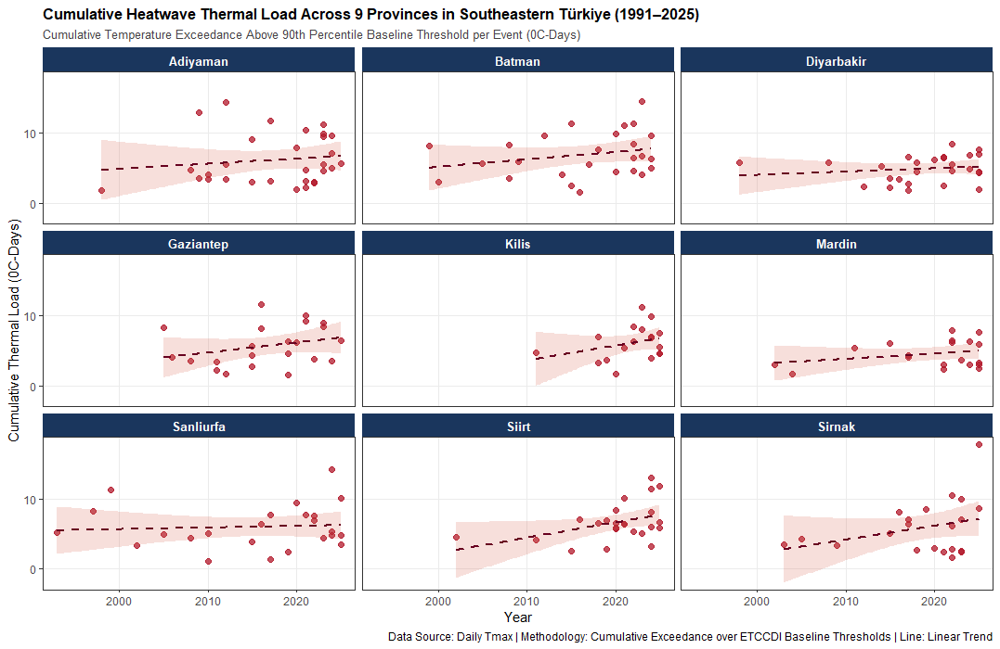

# Temporal Changes in Heatwaves in Southeastern Türkiye

## Overview

This repository presents a climatological analysis of the **temporal variability and long-term changes in heatwaves across Southeastern Türkiye** using daily meteorological data from the **NASA Prediction of Worldwide Energy Resources (NASA POWER)** project.

The study focuses on identifying changes in the **frequency, duration, intensity, and cumulative thermal burden of heatwave events**. Particular attention is given to both daytime and nighttime temperature extremes in order to provide a more comprehensive assessment of increasing thermal stress.

The analysis is designed as a reproducible climate-data workflow implemented in **R**, combining climatological indicators with non-parametric statistical trend analysis.

---

## Research Question

> **Are heatwaves becoming more frequent, longer-lasting, and more intense across Southeastern Türkiye?**

The study investigates whether the characteristics of heatwave events have changed significantly over time and whether these changes exhibit spatial and temporal differences across the region.

---
---

## Key Results

The following figures summarize the main temporal characteristics of heatwave events across Southeastern Türkiye.

### Heatwave Frequency, Duration and Total Heatwave Days



This figure summarizes the temporal evolution of heatwave frequency, maximum duration, and total heatwave days.

### Annual Heatwave Frequency Across Southeastern Türkiye



This figure compares annual heatwave frequency across the nine provinces and highlights regional differences in extreme-heat occurrence.

### Main Findings

The analysis indicates an increasing tendency in heatwave frequency and persistence during the study period. The results suggest that extreme-heat conditions are becoming an increasingly important component of regional climate variability.

Considerable spatial differences are also observed among the provinces, with some locations experiencing more frequent events and others showing stronger changes in duration and cumulative heat exposure.

Overall, the results highlight the importance of evaluating **heatwave frequency, duration, and intensity together** rather than relying solely on mean temperature trends.

---

## Study Region

The analysis covers the major provinces of Southeastern Türkiye, including:

- Adıyaman
- Batman
- Diyarbakır
- Gaziantep
- Kilis
- Mardin
- Siirt
- Şanlıurfa
- Şırnak

The same methodological framework is applied consistently across all locations to facilitate regional comparison.

---

## Data Source

### NASA POWER

Daily meteorological data are obtained exclusively from the:

**NASA Prediction of Worldwide Energy Resources (NASA POWER)**

The analysis primarily uses:

| Variable | Description | Unit |
|---|---|---|
| `T2M` | Air temperature at 2 m | °C |
| `T2M_MAX` | Maximum air temperature at 2 m | °C |
| `T2M_MIN` | Minimum air temperature at 2 m | °C |
| `RH2M` | Relative humidity at 2 m | % |

The primary heatwave detection framework is based on daily maximum temperature, while minimum temperature is used to investigate **hot-night conditions**.

### Temporal Coverage

**1981–2025**

Daily observations are aggregated into annual and event-based heatwave indicators.

---

## Heatwave Definition

Rather than applying a single absolute temperature threshold to all locations, this study uses a **percentile-based threshold approach**.

A location-specific temperature threshold is calculated from the historical distribution of daily maximum temperature.

The primary framework uses:

**90th percentile (P90)**

as the exceedance threshold.

A heatwave event is identified when daily maximum temperature exceeds the location-specific threshold for a predefined minimum number of consecutive days.

This approach accounts for regional climatic differences and avoids applying the same absolute temperature threshold to locations with substantially different climatological characteristics.

---

## Heatwave Indicators

Several complementary indicators are calculated.

### 1. Heatwave Frequency

Number of independent heatwave events occurring during each year.

\[
HW_{freq} = N_{events}
\]

---

### 2. Heatwave Duration

Number of consecutive days associated with each heatwave event.

\[
Duration = D_{end} - D_{start} + 1
\]

Annual statistics include:

- Mean heatwave duration
- Maximum heatwave duration
- Total heatwave days

---

### 3. Heatwave Intensity

The intensity of each event is evaluated according to the temperature exceedance above the local threshold.

\[
Intensity = T_{observed} - T_{threshold}
\]

This provides an estimate of how strongly temperatures exceed the climatological extreme threshold.

---

### 4. Cumulative Heatwave Magnitude

The cumulative thermal burden of an event is calculated as the sum of daily exceedances above the threshold.

\[
Magnitude = \sum_{i=1}^{n}(T_i-T_{threshold})
\]

This allows relatively moderate but long-lasting heatwaves to be distinguished from short but exceptionally intense events.

---

### 5. Hot Days

The annual number of days exceeding the selected extreme-temperature threshold is calculated to identify changes in the frequency of extreme daytime heat.

---

### 6. Hot Nights

Daily minimum temperature is analyzed separately to identify changes in unusually warm nighttime conditions.

This is particularly important because persistent nighttime warmth can reduce nocturnal cooling and increase cumulative thermal stress.

---

## Statistical Analysis

The temporal behavior of heatwave indicators is evaluated using several non-parametric statistical methods.

### Mann–Kendall Trend Test

The Mann–Kendall test is used to determine whether a statistically significant monotonic trend exists in:

- Heatwave frequency
- Heatwave duration
- Heatwave intensity
- Heatwave magnitude
- Hot days
- Hot nights

Statistical significance is evaluated using a conventional significance level of:

\[
\alpha = 0.05
\]

---

### Sen's Slope Estimator

Sen's slope is used to quantify the magnitude and direction of observed trends.

The estimator provides a robust measure of the annual rate of change while being less sensitive to extreme observations than ordinary least-squares regression.

---

### Pettitt Change-Point Test

The Pettitt test is applied to identify potential **abrupt shifts or change points** in the temporal behavior of heatwave indicators.

This allows the analysis to investigate not only gradual trends but also possible periods of structural climatic change.

---

## Analytical Workflow

```text
NASA POWER Daily Data
        │
        ▼
Data Acquisition
        │
        ▼
Quality Control & Cleaning
        │
        ▼
Daily Temperature Series
        │
        ├── T2M_MAX
        ├── T2M_MIN
        └── RH2M
        │
        ▼
Climatological Threshold Calculation
        │
        ▼
Heatwave Detection
        │
        ├── Frequency
        ├── Duration
        ├── Intensity
        ├── Magnitude
        ├── Hot Days
        └── Hot Nights
        │
        ▼
Annual Aggregation
        │
        ▼
Mann–Kendall Trend Analysis
        │
        ▼
Sen's Slope Estimation
        │
        ▼
Pettitt Change-Point Detection
        │
        ▼
Visualization & Interpretation
